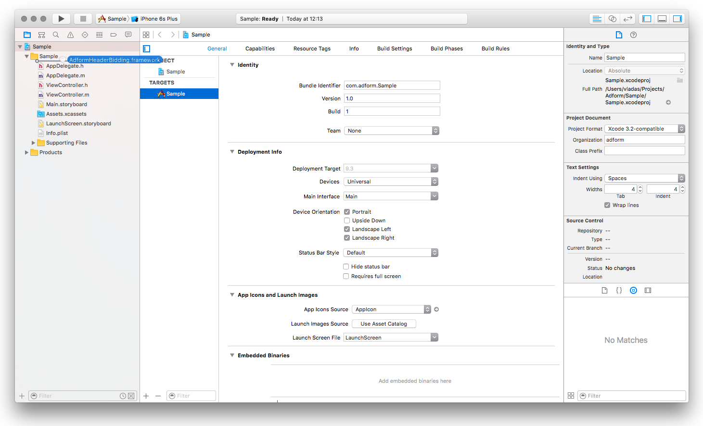
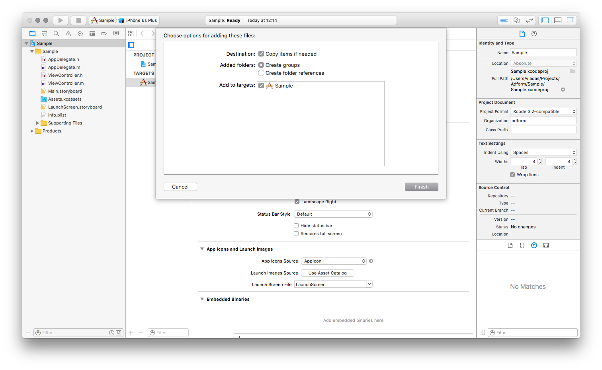
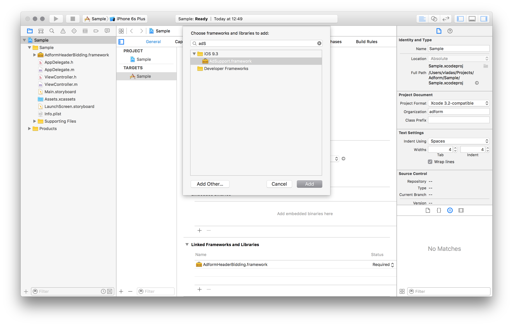

# Getting Started

## 1. General Info

The use of Adform Header Bidding SDK requires the following:

* Xcode 7.0 or later.
* iOS 7.0 or later.
* Requires deployment target 7.0 or later.
* Requires ARC to be enabled. 

## 2. Integration

### 2.1. Using CocoaPods

Adform Header Bidding SDK is available via CocoaPods. CocoaPods is a very popular Objective-C dependency management tool. 

* To use CocoaPods, you should first install the CocoaPods Ruby Gem (CocoaPods is built with Ruby):

````
$ sudo gem install cocoapods
````

* Next, you need to create a `Podfile`, which describes what dependencies you project has. This file should be placed in your project directory. 

````
$ pod init
````

* Next, edit `Podfile` and add the platform identifier and the list of libraries you want to use in the project. 

````
platform: ios

pod 'AdformHeaderBidding'
````

* Finally, you have to install the selected libraries.

````
pod install
````
Thats it!

For more information about CocoaPods visit [CocoaPods site](http://cocoapods.org/about).


### 2.2. Manual

* Download latest build version of Adform Header Bidding SDK.
* Drag **AdformHeaderBidding.framework** to your project.



* When asked select **Copy items into destination group's folder**.



* Go to your application target’s configuration > General > Linked Frameworks and Libraries section and add these frameworks to your project:

   * **AdSupport.framework**
   * **CoreTelephony.framework**
   * **CoreLocation.framework**
   * **SystemConfiguration.framework**



## 3. Using Adform Header Bidding SDK to make requests

It is very easy to make request to Adform ad exchange server with header bidding sdk. 
You just have to create an `AFBidRequest` and send it using `AFBidLoader`.
There is no need to create new instances of `AFBidLoader`, therfore you should just use default bid loader.
Exmaple bellow shows you how to request bids:

````objc
    AFBidRequest *bidRequest = [[AFBidRequest alloc] initWithMasterTagId:mid
                                                           palcementType:AFAdPlacementTypeInline
                                                        supportedAdSizes:@[AFAdDimension(320, 50)]];
                                                     
    [[AFBidLoader defaultLoader] requestBids:bidRequest
                           completionHandler:^(NSArray<AFBidResponse *> *bidResponses, NSError *error) {
        if (error != null) {
            // Handle failed request.
        } else {
            // Handle response of successful request.
            // The bidResponses array contains only one AFBidResponse instance, 
            // therefore you can access it like this.
            
            AFBidResponse *response = bidResponses.firstObject;
            
            // Do something with bid response.
        }
    }];
````

### 3.1 Configuring `AFBidRequest`

Bid request must have `masterTagId`, `placementType` and `supportedAdSizes` properties set before executing. 
To do so you should use convenience initializer `initWithMasterTagId:palcementType:supportedAdSizes:`.
It is possible to set nil to `supportedAdSizes`, in this case ad size will be determined dinamically on the server side 
based on the master tag configuration. Additionaly you can set `bidTimeOut` and `adxDomain` properties. 
`bidTimeOut` defines HTTP request timeout for bid requests, default value 15s. `adxDomain` defines the server to which the request should be sent.
You can set `AFAdxDomainEUR` or `AFAdxDomainUSA`, default value `AFAdxDomainEUR`. `AFAdxDomainEUR` is used for European markets
and `AFAdxDomainUSA` is used for USA markets.

### 3.2 Enabling location tracking on Adform Header Bidding SDK

Adform Header Bidding SDK has an ability to track user location. 
This feature is enabled globally through AFHeaderBiddingSDK class. 
By default user location tracking is disabled. 
This setting doesn't persist between application launches, therefore you need to enable location tracking on every app launch. 
The best place to do this is application:didFinishLaunchingWithOptions: application delegate method. 

```objc
- (BOOL)application:(UIApplication *)application didFinishLaunchingWithOptions:(NSDictionary *)launchOptions
{
    // Override point for customization after application launch.

	[AFHeaderBiddingSDK allowUseOfLocation:YES];
    
    return YES;
}
```

***It is important that you define `NSLocationWhenInUseUsageDescription` key in your applications info.plist file, if you don't have one. 
Otherwise location tracking wont work on iOS 8+. 
You should set its value to "Your location will be used to show relevant ads nearby." or its translation.***

## 4. DFP integration

In order to load Adform banners with Google DFP SDK using Adform Header Bidding SDK
you need to follow these steps:

* Configure a creative for header bidding on DFP interface. Please visit our Publisher help center for more [information](http://publishers.adform.com/documentation/mobile/header-bidding-sdk/dfp/).

* Import Adform Header Bidding SDK and Google DFP SDK to your project.
For more information on Adform Header Bidding SDK integration take a look at 
[the top of the document](#2-integration)
and more information about Google DFP SDK integration can be found 
[here](https://developers.google.com/mobile-ads-sdk/docs/dfp/ios/quick-start).

* Make a bid request using Adform Header Bidding SDK.

```objc

- (void)requestBidWithMasterTagId:(long)mid adSize:(CGSize )size {
    AFBidRequest *bidRequest = [[AFBidRequest alloc] initWithMasterTagId:mid
                                                           palcementType:AFAdPlacementTypeInline
                                                        supportedAdSizes:@[[NSValue valueWithCGSize:size]]];
    
    [[AFBidLoader defaultLoader] requestBids:bidRequest
                           completionHandler:^(NSArray<AFBidResponse *> *bidResponses, NSError *error) {
                               [self handleBidResponses:bidResponses];
                           }];
}

```
    
* Pass bid price, ad unit and bidder name to DFP ad request.

```objc

- (void)handleBidResponses:(NSArray<AFBidResponse *> *)bidResponses {

    // Take the first response.
    AFBidResponse *bidResponse = bidResponses.firstObject;
    
    // Check if we succesfully received a bid response.
    // Bid may be not available.
    if (bidResponse && bidResponse.status == AFBidStatusAvailable) {
        
        // Create DFP ad reqeust.
        DFPRequest *adRequest = [DFPRequest request];
        
        // Set custom targeting parameters. We use these parameters to pass
        // header bidding data to DFP sdk.
        // You need to customize bidding price for hb_pb parameter, that it would be formatted with two trailing zeros (e.g."1.00").
        // To display ads by using Google DFP SDK it requires base64 encoded hb_adid parameter.
        NSDictionary *customTargeting = @{@"hb_pb": [NSString stringWithFormat:@"%.2f", bidResponse.cpm],
                                      @"hb_bidder": @"Bidder",
                                      @"hb_adid":  [bidResponse.adUnitScriptEncoded stringByReplacingOccurrencesOfString:@"=" withString:@"-"] };
        adRequest.customTargeting = customTargeting;
        
        // Load the DFP banner.
        [self loadBanner:adRequest];
    } else {
        // Show error
    }
}

```

* Load the ad.

```objc

- (void)loadBanner:(DFPRequest *)adRequest {

    [self.bannerView loadRequest:adRequest];
}

```

# Release Notes

This part lists release notes from all versions of Adform Mobile Advertising iOS SDK.

## 1.0

### New Features

* First release;
